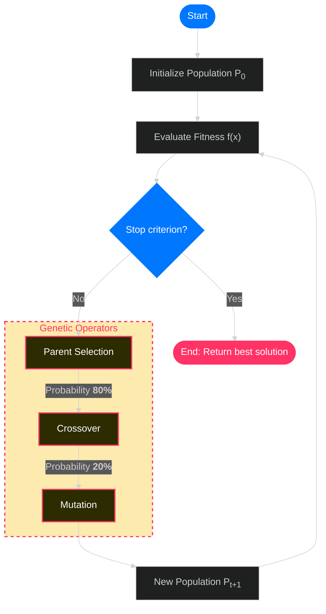

## Content

## The FIFA World Cup 2026 Group Draw
The 2026 FIFA World Cup will be the first to feature 48 national teams from across the globe.
These 48 teams must be distributed into 12 groups through a draw procedure that places interesting constraints on how these groups are formed. Thanks to these constraints, the draw can be conducted quickly and smoothly.
Once the draw is complete, the initial matchups for the tournament are set in stone.

In the 2026 edition, with 48 participating teams, the draw becomes even more complex due to the multiple constraints that must be satisfied<CitationSup id="1" />.


The problem we face when generating the group draw is a **constrained combinatorial optimization problem**.
There is only a limited number of possible combinations that comply with all the restrictions imposed by FIFA; these are called *feasible solutions*.

### Feasible Solution

A feasible solution is one that satisfies the objective function and does not violate any of the problem's constraints—or at least those considered mandatory.

In the context of World Cup groups, a feasible solution is a draw configuration that complies with all imposed rules, such as confederation distribution and team rankings.
Most of the possible combinations that can be made with 48 teams, 4 pots, and 12 groups will *not* be feasible solutions.
Here lies the difficulty of the problem: finding a draw that is valid across all constraints.

This solution space can be extremely large and complex, especially when considering all confederation and ranking constraints.
For example, for the 2026 World Cup, the number of possible draw configurations is astronomical. Let's crunch the numbers.

### Possible Combinations

In the draw, there are 42 teams distributed into 4 pots (containers) to be allocated into 12 groups (from A to L). Teams are drawn randomly from each pot until it is empty, ensuring that each group has one team from each pot.
The hosts (Canada, Mexico, and the United States) have their groups assigned beforehand, and there are 12 teams in each pot.


Now, let's calculate all **possible combinations** without considering restrictions, using factorials ($n!$).
- Pot 1: $9!$,
- Pots 2, 3, and 4: $12!$
- Total: $9! \times  12! \times 12! \times12! = 3.9881 \times 10^{31}$ possible combinations.
>__Just how big is this number?__
>39, 881, 724, 135, 495, 319, 399, 956, 480, 000, 000 possible ways to organize teams into groups. Ignoring constraints.
>
>To get an idea of the magnitude: if we could evaluate every draw generated by a brute-force algorithm in 0.05 seconds, evaluating all possible solutions would take $6.3 \times 10^{22}$ years.
If the algorithm had started at the Big Bang, it wouldn't have finished yet; in fact, it would only be 0.00000000002% of the way through.

Therefore, a brute-force algorithm—one that generates every possible combination until it finds one that doesn't violate restrictions (a feasible one)—could take millions of years.
Fortunately, optimization algorithms exist whose search is far more efficient than brute force, reducing this time to a couple of seconds.
For the FIFA World Cup group draw, we will use a **Genetic Algorithm**.

### Draw Constraints

The draw constraints define the rules of engagement when pulling teams from pots to assign them to groups. FIFA has redefined the restrictions for the 2026 World Cup since it is the first with 48 teams and 12 groups.

First, it must be clarified that the names of the 42 teams are divided into four containers (pots) ordered according to the FIFA Ranking <CitationSup id="2" />.

The restrictions are as follows <CitationSup id="3" />:
- *Hosts:* Mexico will be assigned position A1, Canada position B1, and the United States position D1.
- *Pot 1:* The other nine teams in Pot 1 will be identified by nine balls of the same color and automatically assigned to position 1 of the group into which they are drawn.
- *Uniform Distribution:* Each group must have one team from each pot.
- *Confederations per Group:* No group can have more than one team from the same confederation, except for UEFA, which can have up to two teams in the same group.
- *Top 4 Ranking:* Finally, Spain and Argentina on one side, and France and England on the other, cannot face each other until the semifinals, as they are the top four in the FIFA Men's Ranking at the time <CitationSup id="2" />. This restricts their placement into arbitrary groups.


These are what we call the *hard constraints* of the problem.
Attempting to generate all possible combinations and then filtering for those that meet the constraints would be computationally intractable, as we have already seen.

## What is a Genetic Algorithm?
Without diving too deep, a Genetic Algorithm (GA) is an optimization algorithm inspired by the reproduction of populations from generation to generation  and biological evolutionary processes. They fall under the umbrella of *evolutionary algorithms*.

The theoretical foundations and initial concepts of genetic algorithms belong to the work of John Holland and Lawrence Fogel in the 1960s<CitationSup id='4'/><CitationSup id='5'/>.

A genetic algorithm consists of a population of individuals representing candidate solutions to the problem we want to solve.
Each of these solutions is evaluated by a cost, fitness, or objective function that measures how good the solution is.
Then, the best solutions are selected to reproduce and generate new solutions through *crossover* and *mutation* operations.

This process repeats over several generations until a termination criterion is reached, such as a maximum number of generations or a sufficiently good solution.

### Basic Genetic Algorithm
In the lifecycle of a genetic algorithm, there are values that do not change, called *hyperparameters*, and their value can determine the success or failure of the algorithm, as some __metaheuristics__ are very sensitive to these inputs. In our case, these hyperparameters are:
- Population Size: How many individuals (candidate solutions) will make up the population in each generation.
- Number of Generations: How many times the algorithm's lifecycle will repeat.
- Crossover Probability: Set at 80%, as this value is usually effective for exploring the search space.
- Mutation Probability: Set at 20%, as this value effectively maintains genetic diversity without altering existing solutions too much.
```python
POBLACION_TAM = 10 # Population size
GENERACIONES = 1000 # Number of generations
PROB_CROSSOVER = 0.8  # 80% crossover probability
PROB_MUTACION = 0.2  # 20% mutation probability
```

The lifecycle of a basic genetic algorithm can be represented by the following flowchart:


## Initial Population
Genetic algorithms belong to the set of metaheuristics classified as population-based. In this type of algorithm, a set of solutions is evaluated in each iteration, which we call a population. Each population is made up of individuals, and each of these must be evaluated by the cost function. In the best-case scenario, a solution is reached when an individual is found that has optimal Fitness and does not incur any violation of restrictions.

In our case, for this problem, each individual is a draw, as mentioned before. This individual may contain schemas that violate the draw rules and constraints. It is the Fitness function that will punish this individual by assigning values that push it further away from the optimum.

Before defining the population, it is important to first define the individuals that make up the population. We call this the encoding of the individual. Each individual in the population is a draw which we must find a way to represent in the algorithm and create (encoding).

The following code shows the process of creating an individual in a procedure similar to the actual draw; that is, teams are assigned pot by pot, from the first to the fourth. Ignoring restrictions, individuals can be valid or invalid, depending on whether they violate constraints. It is the algorithm that must determine who is the best or optimal among all individuals.

```python
def crear_individuo(lista_equipos):
    # Create an initial valid individual (draw)
    bombos = {1: [], 2: [], 3: [], 4: []}
    # Distribute teams by pot
    for eq in lista_equipos:
        bombos[eq.bombo].append(eq)
    # Assign teams to groups
    grupos = [[] for _ in range(12)]
    for b in range(1, 5):
        equipos = bombos[b]
        # Shuffle for randomness
        random.shuffle(equipos)
        pendientes = []
        for eq in equipos:
            if eq.grupo_fijo:
                # Assign to fixed group and skip (converts group letter to index)
                idx = ord(eq.grupo_fijo) - 65
                grupos[idx].append(eq)
            else:
                pendientes.append(eq)
        idx_p = 0
        # Assign remaining teams from this pot
        for g_idx in range(12):
            if len(grupos[g_idx]) < b:
                grupos[g_idx].append(pendientes[idx_p])
                idx_p += 1
    return grupos
```

### Individual Structure

We have already said that each individual of the genetic algorithm represents a candidate solution to the problem. This is a group draw with the 12 complete groups, regardless of whether they are valid or not. Since each draw is composed of groups, each group represents what we call a gene within the individual.

For our code, each gene consists of elements of the `Equipo` (Team) class that contains the relevant information for each national team:
```python
class Equipo:
    def __init__(self, nombre, confederacion, bombo, grupo_fijo=None, ranking_top=None):
        self.nombre = nombre
        self.confederacion = confederacion  # Simple String
        self.bombo = bombo
        self.grupo_fijo = grupo_fijo
        self.ranking_top = ranking_top  # 1, 2, 3, 4 or None

    def __repr__(self):
        # Shows useful info when printing
        r = f" [R#{self.ranking_top}]" if self.ranking_top else ""
        f = f" (Fixed:{self.grupo_fijo})" if self.grupo_fijo else ""
        return f"{self.nombre}{r}{f}"
```
For example, a top 4 team would be represented like this:
```python
Equipo("Spain", ["UEFA"], 1, ranking_top=1)
Equipo("Argentina", ["CONMEBOL"], 1, ranking_top=2)
```
And host teams with a fixed group:

```python
Equipo("Mexico", ["CONCACAF"], 1, grupo_fijo="A")
Equipo("Canada", ["CONCACAF"], 1, grupo_fijo="B")
```
The rest of the teams are instantiated to the Team class more simply:

```python
Equipo("Germany", ["UEFA"], 1)
Equipo("Ecuador", ["CONMEBOL"], 2)
Equipo("Panama", ["CONCACAF"], 3)
# And so on until the rest are complete...
```
## Fitness Function
The simplest way to evaluate an individual with these characteristics is by creating an objective function that counts the times restrictions are violated. For each violation, it assigns a penalty to that individual—an unfavorable valuation so that in the lifecycle of the algorithm, this individual falls behind, cannot reproduce, and eventually goes extinct.


The algorithm seeks to minimize this number. A fitness of 1400 is a disaster; a fitness of 0 is a valid draw.

The function `calcularFitness(sorteo)` is the engine of the algorithm. Its goal is to reach zero, meaning it has found an individual whose evaluation violates none of the restrictions.

Upon finding one of these, the algorithm has found the optimum, i.e., a valid draw. This is where the aforementioned constraints come into play.

Here we apply Hard Constraints:

- Confederations: No group can have more than one team from the same confederation (except Europe, which allows two).

```python
for j in range(len(grupo)):
            for k in range(j + 1, len(grupo)):
                equipo_a = grupo[j]
                equipo_b = grupo[k]

                # Set intersection:
                set_a = set(equipo_a.confederacion)
                set_b = set(equipo_b.confederacion)
                interseccion = set_a.intersection(set_b)

                # If there is intersection and it is NOT UEFA (because UEFA allows 2), we penalize
                conflicto_real = [c for c in interseccion if c != "UEFA"]

                if conflicto_real:
                    penalizacion += PENALTY_CONF_LIMIT
```
- Itineraries: The Top 4 seeded teams must be distributed in opposite brackets so they do not meet before the semifinals. If Top 1 and Top 2 land on the same side of the bracket, we apply a massive penalty (+500).
```python
# We create a dictionary to know where the Top 4 are
  ubicacion_tops = {}
    # For each group we get that location:
    for equipo in grupo:
            if equipo.ranking_top:
                ubicacion_tops[equipo.ranking_top] = i

    # Rule: Top 1 and Top 2 must go on opposite sides of the itinerary
    if 1 in ubicacion_tops and 2 in ubicacion_tops:
        it_1 = obtener_itinerario(ubicacion_tops[1])
        it_2 = obtener_itinerario(ubicacion_tops[2])
    # Penalize if they are on the same side of the bracket
    if it_1 == it_2:
        penalizacion += PENALTY_ITINERARY
```
Let's see the complete cost function. Its goal is to evaluate each group, count the times a restriction is violated, and apply penalties.


```python
def calcular_fitness(sorteo):
    """
    Calculates total penalty of a draw (chromosome).
    0 = Valid draw.
    return: penalty
    """
    penalizacion = 0

    # Penalty Constants (Weights)
    PENALTY_CONF_LIMIT = 1000  # Confederation conflict (Severe)
    PENALTY_UEFA_LIMIT = 500  # More than 2 Europeans
    PENALTY_ITINERARY = 500  # Top seeds clashing before final

    # Track where Top seeds landed {ranking: group_index}
    ubicacion_tops = {}

    # --- 1. Loop through Groups ---
    for i, grupo in enumerate(sorteo):

        # A. Check UEFA limit (Max 2)
        # Count how many teams have 'UEFA' in their confederation list
        uefa_count = sum(1 for equipo in grupo if ["UEFA"] in equipo.confederacion)

        if uefa_count > 2:
            # Penalize to correct it
            penalizacion += PENALTY_UEFA_LIMIT * (uefa_count - 2)

        # B. Check Confederation clashes (NON-UEFA)
        # Use double for loop to compare everyone against everyone in the group
        for j in range(len(grupo)):
            for k in range(j + 1, len(grupo)):
                equipo_a = grupo[j]
                equipo_b = grupo[k]

                # Set intersection:
                # If Team A is ['CONMEBOL'] and Team B (Playoff) is ['CONMEBOL', 'AFC']
                # The intersection is {'CONMEBOL'} -> Conflict!
                set_a = set(equipo_a.confederacion)
                set_b = set(equipo_b.confederacion)
                interseccion = set_a.intersection(set_b)

                # If there is intersection and it is NOT UEFA (because UEFA allows 2), we penalize
                # Note: If both are UEFA, 'UEFA' will be in the intersection,
                # but we already controlled that above with uefa_count.
                conflicto_real = [c for c in interseccion if c != "UEFA"]

                if conflicto_real:
                    penalizacion += PENALTY_CONF_LIMIT

        # C. Save location of Tops for phase 2
        for equipo in grupo:
            if equipo.ranking_top:
                ubicacion_tops[equipo.ranking_top] = i

    # --- 2. Itinerary Penalties (Bracket) ---

    # Rule: Top 1 and Top 2 must go on opposite sides of the itinerary
    if 1 in ubicacion_tops and 2 in ubicacion_tops:
        it_1 = obtener_itinerario(ubicacion_tops[1])
        it_2 = obtener_itinerario(ubicacion_tops[2])

        if it_1 == it_2:
            penalizacion += PENALTY_ITINERARY

    # Rule: Top 3 and Top 4 must go on opposite sides of the itinerary
    if 3 in ubicacion_tops and 4 in ubicacion_tops:
        it_3 = obtener_itinerario(ubicacion_tops[3])
        it_4 = obtener_itinerario(ubicacion_tops[4])

        if it_3 == it_4:
            penalizacion += PENALTY_ITINERARY

    return penalizacion
```

## Genetic Algorithm Lifecycle
In a population-based algorithm, a population of individuals is created, and this population is traversed evaluating the cost of each one in search of the optimum. If none is found, we must resort to genetic operators, which are responsible for creating variations in the population to generate new individuals.

These operators are mutation and crossover, simulating aspects of genetics. Mutation is equivalent to taking an individual (chromosome) and randomly changing an element (gene). Crossover simulates the reproduction of two individuals. It consists of taking two individuals and exchanging genetic material (sections of the individual) between one and the other. Both crossover and mutation have many variants<CitationSup id="6"/>; in this case, we apply the simplest ones, which are those defined previously.

In the specific case of the draw, crossover is done by taking two individuals via the roulette mechanism. These two will play the role of father and mother reproducing to generate a child; this child will be the new generated individual.

The `cruzar()` function takes two parents and randomly decides which will be the donor and receptor (although actually both donate). Each donor will swap all groups received from a specific pot with the other parent.
```python
def ejecutar_ga_completo():
    # --- CONFIGURATION ---
    POBLACION_TAM = 10
    GENERACIONES = 1000
    PROB_CROSSOVER = 0.8  # 80% crossover probability
    PROB_MUTACION = 0.2  # 20% mutation probability
    K_TORNEO = 2  # Tournament size for selection

    datos = generar_datos_usuario()
    poblacion = [crear_individuo(datos) for _ in range(POBLACION_TAM)]

    print(f"🧬 Starting GA (Pc={PROB_CROSSOVER}, Pm={PROB_MUTACION})...")

    for gen in range(GENERACIONES):
        # Evaluate Fitness
        # Save (score, individual)
        evaluados = [(calcular_fitness(ind), ind) for ind in poblacion]
        evaluados.sort(key=lambda x: x[0])

        best_score = evaluados[0][0]
        # Monitoring
        if gen % 100 == 0 or best_score == 0:
            print(f"Gen {gen}: Best Cost = {best_score}")

        if best_score == 0:
            print(f"✅ PERFECT SOLUTION FOUND IN GEN {gen}!")
            return evaluados[0][1]

        # Selection (Simple Tournament)
        nueva_poblacion = []

        while len(nueva_poblacion) < POBLACION_TAM:
            
            # OPTION A: TOURNAMENT
            # padre1 = seleccion_torneo(evaluados, k=K_TORNEO)
            # padre2 = seleccion_torneo(evaluados, k=K_TORNEO)

            # OPTION B: ROULETTE
            padre1 = seleccion_ruleta(evaluados)
            padre2 = seleccion_ruleta(evaluados)

            # Crossover subject to probability (0.8)
            if random.random() < PROB_CROSSOVER:
                hijo1, hijo2 = cruzar(padre1, padre2)
            else:
                hijo1, hijo2 = copy.deepcopy(padre1), copy.deepcopy(padre2)
            # Mutation subject to probability (0.2)
            hijo1 = mutar(hijo1, PROB_MUTACION)
            hijo2 = mutar(hijo2, PROB_MUTACION)

            nueva_poblacion.append(hijo1)
            if len(nueva_poblacion) < POBLACION_TAM:
                nueva_poblacion.append(hijo2)
        poblacion = nueva_poblacion

    print("⚠️ Limit reached. Returning best approximation.")
    return evaluados[0][1]
```

## Genetic Operators
The first operator to be applied is called selection. The goal of selection is to simulate Darwin's law of survival of the fittest. Like other operators, there are many ways to perform selection, with roulette and tournament being among the most used.

In the tournament operator, pairs of individuals are taken and their fitness value is compared. In each pair, the winner "qualifies" and faces other winners until a tournament winner is obtained. This winner is selected for crossover.

The roulette operator simulates the behavior of a roulette wheel; however, the spaces or divisions of this wheel are not equal. The probability of selecting an individual is proportional to its fitness value. The higher the fitness (or lower cost), the higher the probability of being selected. The selected individuals form part of the parents from which the new population of individuals will emerge via other genetic operators.

### Selection

We don't let just anyone reproduce. The roulette operator is utilized, although the tournament operator also appears in the code. This operator takes all individuals of a generation and creates an array called `pesos` (weights) containing the inverse of the fitness value of each. Then it randomly selects one using the `random.choices()` function which assigns an individual randomly, but with a probability proportional to its fitness value, designated in the code by the `pesos` variable.

This process is repeated to generate each Parent, for every individual in every generation. This generates enough individuals to completely replace (in equal numbers) all individuals of a generation.
```python
def seleccion_ruleta(evaluados):
    """
    Input: List of tuples (fitness, individual)
    Selection proportional to fitness (Roulette).
    Since we seek to MINIMIZE cost, we invert the value.
    Fitness 0 -> Very high weight. Fitness 500 -> Low weight.
    """
    individuos = [item[1] for item in evaluados]
    costos = [item[0] for item in evaluados]

    # We invert costs to obtain weights (Higher weight = Higher probability)
    pesos = [1.0 / (1.0 + c) for c in costos]

    # The choices function with 3 arguments (population, weights, quantity)
    seleccionado = random.choices(population=individuos, weights=pesos, k=1)[0]

    return seleccionado
```
### Crossover

Crossover is the most important operator, as it is responsible for creating diversity and exploring the search space. Crossover takes two parents and creates a child. This leads to the replacement of the current population by a new generation. In our case, we must be very careful because we cannot perform a crossover at just any point of the individual (chromosome). If we slice a draw in half and swap it with another, we would break the structure of the pots.

The crossover operator defined in the cruzar() function operates pot by pot. For Pot 1 (Top seeds), flip a coin: Do you inherit the distribution from Parent A or B? Repeat for Pots 2, 3, and 4.

This guarantees that the child is structurally valid (there will always be one team from each pot in each group) but genetically new.

For each pot (1, 2, 3, 4):

Flip coin: from which parent to inherit this pot?

Child1 inherits complete pot from selected parent

Child2 inherits complete pot from other parent

Result: 2 new draws (children)

```python
def cruzar(padre1, padre2):
    """
    Stratified Crossover Operator (Uniform Crossover by Pots).
    The child inherits the entire configuration of a pot from one of the parents.
    """
    # Empty children
    hijo1 = [[] for _ in range(12)]
    hijo2 = [[] for _ in range(12)]
    # We iterate through each Pot level (0 to 3)
    for bombo_idx in range(4):
        # Random decision: Who donates this pot?
        if random.random() < 0.5:
            # Case A: Child 1 inherits from Father 1, Child 2 inherits from Father 2
            donante_1 = padre1
            donante_2 = padre2
        else:
            # Case B: Crossed
            donante_1 = padre2
            donante_2 = padre1

        # We copy the entire row of that pot to the children
        for g_idx in range(12):
            equipo_p1 = donante_1[g_idx][bombo_idx]
            equipo_p2 = donante_2[g_idx][bombo_idx]

            hijo1[g_idx].append(equipo_p1)
            hijo2[g_idx].append(equipo_p2)
    return hijo1, hijo2
```
### Mutation

If we only cross parents, eventually all children will look alike, and we will stagnate in a "Local Minimum" (a solution that seems good but is not the best).

The `mutar(individuo)` function introduces controlled chaos. With a 20% probability, we take a draw, pick two random groups, and swap two teams from the same pot.

If it mutates:
1. Pick 2 random groups
2. Pick a random pot (1, 2, 3, or 4)
3. Swap the teams of that pot between the 2 groups
4. Only if neither has a fixed group

```python
def mutar(individuo, prob_mutacion):
    """
    Attempts to mutate with probability 'prob_mutacion'.
    """
    if random.random() > prob_mutacion:
        return individuo  # Does not mutate

    # If it mutates, we perform the swap
    nuevo = copy.deepcopy(individuo)
    idx_g1, idx_g2 = random.sample(range(12), 2)
    bombo_idx = random.randint(0, 3)

    e1 = nuevo[idx_g1][bombo_idx]
    e2 = nuevo[idx_g2][bombo_idx]

    if not e1.grupo_fijo and not e2.grupo_fijo:
        nuevo[idx_g1][bombo_idx], nuevo[idx_g2][bombo_idx] = (
            nuevo[idx_g2][bombo_idx],
            nuevo[idx_g1][bombo_idx],
        )

    return nuevo
```
Replacement

The new generation completely replaces the previous one (this is debatable).

Termination Criterion
To end the lifecycle, the value does not strictly need a termination criterion. One method is to terminate the algorithm if the maximum amount of previously stipulated generations is reached. The other, if it detects that an individual has a Fitness equal to zero, also terminates the algorithm and takes this individual as the optimal solution.

Termination Criteria:

If a draw with penalty = 0 is found -> Success!

If it reaches generation 1000 -> return the best one found.

Fortunately, the pot structure allows finding solutions quickly with genetic algorithms, and there is usually no need to resort to the generation termination criterion.

Results
Visit this blog entry (clicking here 👀) to see an example of a draw generated by the genetic algorithm. You can also test the full code in the GitHub repository by clicking the link below.

<RepoBadge url={"https://github.com/EricLuceroGonzalez/algorithms-share/tree/main/Genetic-algorithms"}/> 
<ReferenceList 
references={[ 
    {id:"1", text:"FIFA Draw Constraints", url:"https://www.fifa.com/es/tournaments/mens/worldcup/canadamexicousa2026/articles/sorteo-copa-mundial-2026-procedimiento-sorteo-final"}, 
    {id: "2", text:"FIFA/Coca-Cola Men's World Ranking.", url: "https://inside.fifa.com/es/fifa-world-ranking/men"}, {id: "3", text:"Procedure for the Final Draw of the FIFA World Cup 2026™", url:"https://digitalhub.fifa.com/m/3fd60e2399fe26ff/original/Procedimiento-del-sorteo-de-la-Copa-Mundial" }, {id: "4", text:"John Holland, Adaptation in Natural and Artificial Systems, 1975", url: "https://mitpress.mit.edu/books/adaptation-natural-and-artificial-systems"}, {id: "5", text:"Lawrence Fogel, Intelligent decision making through a simulation of evolution, 1966", url: "https://doi.org/10.1002/bs.3830110403"}, {id: "6", text:"Larrañaga et al, Genetic Algorithms for the Travelling Salesman Problem: A Review of Representations and Operators", url:"https://doi.org/10.1023/A:1006529012972"} ]}/>