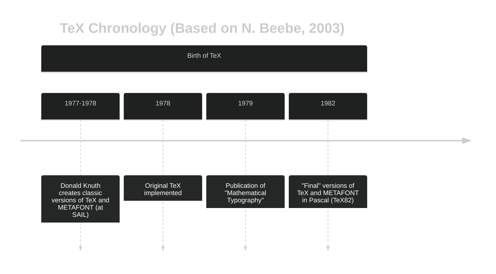
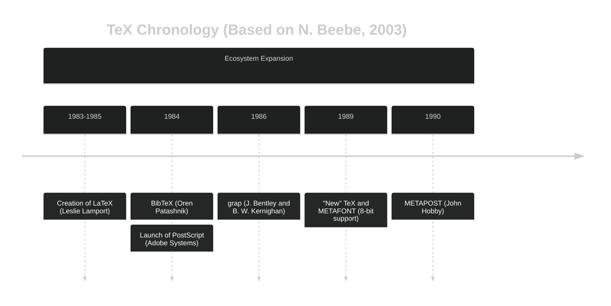
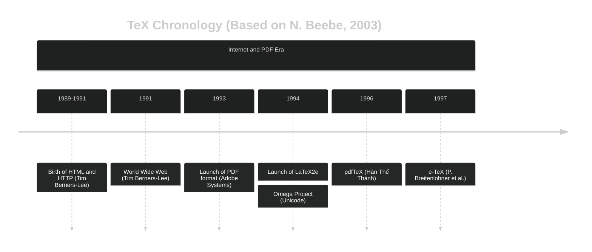

$\TeX$ is a typesetting system created by Donald Knuth in the 1970s to produce high-quality documents, predating PDF, the internet, HTML, and modern digital printing.

## Content

## The Rise of TeX: A Response to the Typographic Crisis

To understand **TeX**, we must first travel back to the late 1960s. It all starts with Stanford professor **Donald Knuth** and his ambitious work *The Art of Computer Programming*.
The first volume was published in 1978 and the second five years later.

It could be said that $\TeX$ was born at the _Stanford Artificial Intelligence Laboratory (SAIL)_, Knuth's workplace, as a response to the typographic crisis facing the printing of scientific and mathematical books at that time, a problem that Knuth took _very personally_. A crisis that Donald Knuth, with his healthy obsession for typographic quality, could not tolerate.

>It was a monumental work, filled with complex mathematical formulas and intricate diagrams. Knuth, a perfectionist obsessed with typographic quality, was delighted with the book's printing.

Until those years, the creation of high-quality mathematical documents depended on a technology that had reached its peak in the late 19th century: hot metal composition using two types of machines.
The **Monotype** machine<CitationSup id={1}/> (machines that cast individual characters, allowing greater flexibility for mathematical notation) produced the highest quality mathematical texts until then.

Unfortunately for Knuth and fortunately for $\TeX$, in the 1970s, this technology became obsolete for economic reasons and was replaced by phototypesetting.
>This drop in visual quality (beauty, according to Knuth) was what "horrified" Knuth when he saw the proofs for Volume 2 of *The Art of Computer Programming*, driving him to create TeX to digitally restore the quality of the old master craftsmen.

Knuth himself recounts this in a speech titled *Digital Typography* <CitationSup id={2}/> at the Kyoto Prize lecture in 1996.

>Knuth, being a perfectionist since childhood, decided he couldn't tolerate that.

## The Obsession with Typographic Quality and Composition

A famous anecdote from his youth<CitationSup id={3}/> is when he won a contest from the Ziegler's Giant Bar candy company.
The challenge was to form as many words as possible from the letters in the phrase "Ziegler's Giant Bar".
While the judges expected a few dozen, the 13-year-old Knuth, feigning a stomach ache to stay home and work on it, methodically found over 4,700 words, demonstrating his early obsession with combinatorics, lists, and systematic data processing (even before owning a computer).

Another anecdote told in his Kyoto Prize speech <CitationSup id={2}/> speaks of his interest in letters and typography from a very young age.
<QuoteAndAuthor quotation={{ quote: "In fact, not only have I always loved books, but I am also fascinated by individual letters. Here is a page from the first alphabet book I had as a child. Interestingly, I marked each serif with a small x and counted them: the letter K has 7 serifs. The letter P has 4; the letter O has none.", author: "Donald Knuth", source: "Notes from Kyoto Prize Lecture (1996)"}} />

### Knuth Decides to Solve the (Typographic) Problem Himself
After the disappointment of receiving the galleys typeset with the new technologies of the era, he began looking for an editorial solution, finding some people in Poland who still used the old typographic technology, but this proved almost impossible.
<QuoteAndAuthor quotation={{ quote: "My whole book had been completely retypeset with a different technology. The new fonts looked terrible! The subscripts were in a different style from the large letters, for example, and the spacing was very bad. You can look at books printed in the early 70s and it turns out that if it wasn't simple -- well, almost everything looked atrocious in those days.  I couldn't stand to see my books so ugly.", author:"Donald Knuth", source: "An Interview with Donald Knuth (2007)"}} />
At that time, Knuth was already working at the *Stanford Artificial Intelligence Laboratory* (SAIL), led by none other than John McCarthy. There, they had a Xerox XGP printer<CitationSup id={4}/> capable of printing with a density of *120 dots per inch*, much better than the common dot matrix printers of that era, though not sufficient to produce the typefaces Knuth wanted.
In the midst of this search, in February 1977, he stumbled upon the proofs of the first edition of Patrick Winston's *Artificial Intelligence* book<CitationSup id={5}/>, which had been composed with a high-resolution matrix printer at the company Information International, Inc. (III), with a density of 1000 dots per inch.
Knuth was impressed by the print quality, and above all by the technique. The method of composition used was based on pixels; it was totally digital, using dots of ink. Instead of photographic images, the printer used algorithms to calculate the exact position of each dot of ink on the page. Bits, as Knuth says in <CitationSup id={6}/>.
<QuoteAndAuthor quotation={{ quote: "The problem of printing beautiful books had changed from a problem of metallurgy to a problem of optics and then to a problem of computer science. A problem of zeros and ones.", author: "Donald Knuth", source: "Donald Knuth's Kyoto Prize Lecture (1996)"}} />

At this moment, Knuth abandoned everything he was doing (he was about 100 pages into the fourth volume of *The Art of Computer Programming*) and decided to solve **the problem** himself.
>He thought it would take him a few months to write a program to solve this problem during his 1978 sabbatical year in Chile (where he also intended to learn Spanish). It took him nearly a decade. The result was **TeX**.

At this point, Knuth realized several problems. First, no one else was working on this problem. Second, a typesetting machine was expensive for a university budget. Third, one could not think about a typographic printing system without having the necessary fonts and symbols. Knuth had to design mathematical formulas to describe the shape of the fonts and characters.
He tried to seek help from Xerox, but the condition was that the usage rights of the fonts he developed would belong to Xerox.
Knuth disagreed with this, thinking that a mathematical formula could not be owned by anyone<CitationSup id={6}/>.

He attempted to work with the technologies available at SAIL, but they weren't enough. It involved capturing the image of typographic fonts with the greatest possible precision using television cameras.
This was to trace the fonts and characters as accurately as possible. He also tried with the help of his wife, photographing printed letters with a high-resolution camera and projecting them onto a wall to trace the curves freehand; however, they weren't clear enough.
In this attempt, he realized something simple: that *fonts were designed by people*, and he realized that if people do it, he could write a computer program to do it.
Thus **METAFONT** was born, the system for designing typographic fonts through mathematical algorithms<CitationSup id={7}/>, seeking to find what Knuth called *the most pleasing curve*, which he found using cubic expressions.

In typographic font design, it is important to mention Hermann Zapf, a German typographer who designed classic fonts like Palatino, Optima, and Zapfino, who collaborated with Knuth in the 80s on the design of the **Computer Modern** font, the default font of TeX<CitationSup id={8}/>.

In mid-1977, while working on the TeX prototype, Knuth wrote a preliminary note describing the system, explaining the name and purpose of TeX. In May 1977, Knuth stated:
<QuoteAndAuthor quotation={{ quote: "TEX is for technical text. Insiders pronounce the X as a Greek Chi (cf. the Scottish `ch' sound in `Loch Ness') since the word `technical' stems from a Greek root meaning art as well as technology. I am preparing the system   primarily for use in publishing my series The Art of Computer Programming-- the initial system will be tuned for my books, but it will not be difficult to extend it for other purposes if anybody wants to do so.", author: "Donald Knuth", source: "Preliminary preliminary description of TEX (1977)"}} />

Today, $\TeX$ is used by major publishers like Addison-Wesley (the publisher of *The Art of Computer Programming*), Elsevier, Oxford, and Springer<CitationSup id={9}/>. Hundreds of books have been published using this system, along with thousands of scientific articles worldwide. Even universities have their theses in this format.

## But How Can TeX Print?
First, METAFONT defined equations for the curves (cubic Bézier curves) and the stroke width. This created an "ideal letter" that was resolution-independent; it existed only as pure mathematics (coordinates).
To print, TeX used a process called "rasterization" that converted these mathematical definitions into a matrix of dots (pixels) that the printer could understand.
The output of the compilation process consisted of several files, among them the DVI (Device Independent) file containing the instructions to place each character on the page, and the font files generated by METAFONT.

This is why $\TeX$ composes high-quality documents even without the existence of PDF. It was conceived for the printing press.
It is also important to mention that TeX was designed to be independent of the output device (printer or screen), so a document written in TeX in 1990 can be printed today (or in a hundred years) without problems on a modern printer, maintaining the same typographic quality.

## Brief Chronology of TeX and Its Ecosystem
$\TeX$ is one of the longest-lived pieces of software in existence, and its development has been constant since its creation in the 70s. It was invented in 1978, and the "final" version (1.0) was released in 1982, known as $\TeX 82$.

It predates several important technologies like PostScript (1984) and PDF (1993), as well as the HTTP protocol, the World Wide Web, and HTML. It has evolved to adapt to new times, including support for Unicode and native PDF.

## The Last Version, Numbers $\pi$ and $e$
In 1990, Knuth announced that TeX and METAFONT would not change anymore, but only small bug fixes would be made. As such, their new versions would be numbered with the decimals of $\pi$ and $e$ respectively, until the date of his death. At this moment, the versions would be frozen, marking the end of updates to the source code of $\TeX$ and METAFONT.

> The current version of TeX is $\TeX\, 3.14159265$ and METAFONT is $2.7182818$.

In part 2 of this post, we will continue discussing the characteristics of TeX, the peculiarity of its name, its current ecosystem, and its applications.

## References
<ReferenceList references={[
  {id: "1", text:"Monotype System", url:"https://en.wikipedia.org/wiki/Monotype_system"},
  {id: "2", text: "Donald Knuth's Kyoto Prize Lecture (1996)", url:"https://www.kyotoprize.org/en/lectures/the-1996-kyoto-prize/"},
  {id:"3",text:"The Computer Scientist Who Can't Stop Telling Stories",url:"https://www.quantamagazine.org/computer-scientist-donald-knuth-cant-stop-telling-stories-20200416/"},
  {id:"4",text:"Xerox Graphics Printer (XGP)",url:"https://gunkies.org/wiki/Xerox_Graphics_Printer"},
  {id:"5",text:"Artificial Intelligence, Patrick H. Winston (1977)",url:"https://en.wikipedia.org/wiki/Artificial_Intelligence_(book)"},
  {id:"6",text:"An Interview with Donald Knuth 1974 ACM Turing Award Recipient (2007)",url:"https://amturing.acm.org/pdf/KnuthTuringTranscript.pdf"},
  {id:"7",text:"METAFONT on Wikipedia",url:"https://en.wikipedia.org/wiki/Metafont"},
  {id:"8",text:"Mathematical Typography, D. E. Knuth, Bulletin of the American Mathematical Society, Volume 1, Number 2, 1979, pp. 337-372.",url:"https://projecteuclid.org/journalArticle/Download?urlId=bams%2F1183544082&isResultClick=False"},
  {id:"9",text:"25 Years of TeX and METAFONT: Looking Back and Looking Forward, Nelson Beebe (2003)",url:"https://www.tug.org/TUGboat/Articles/tb25-1/beebe-2003keynote.pdf"},
]}/>