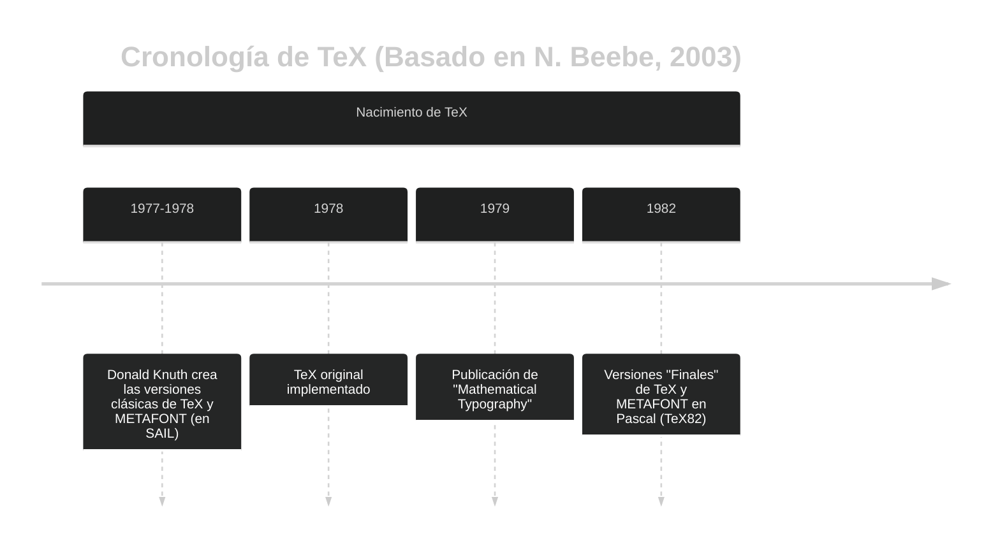
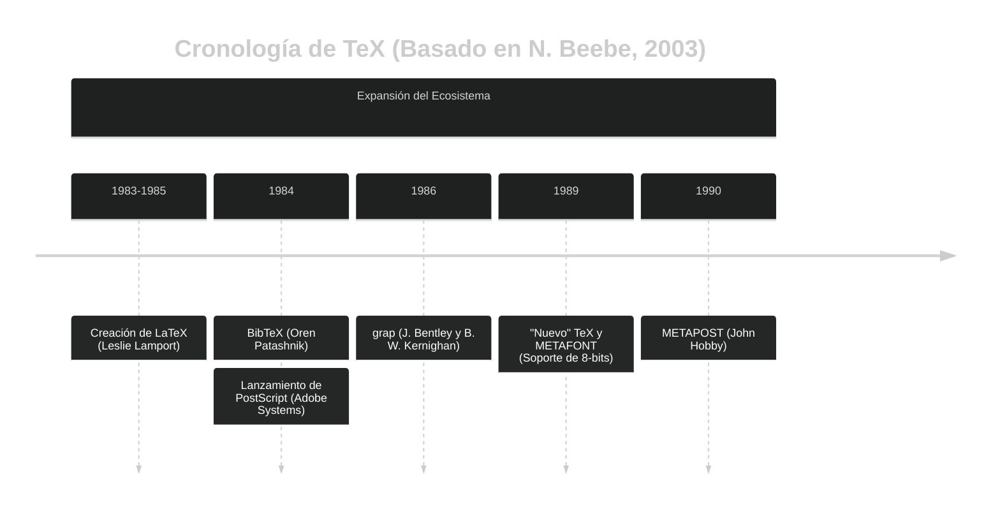
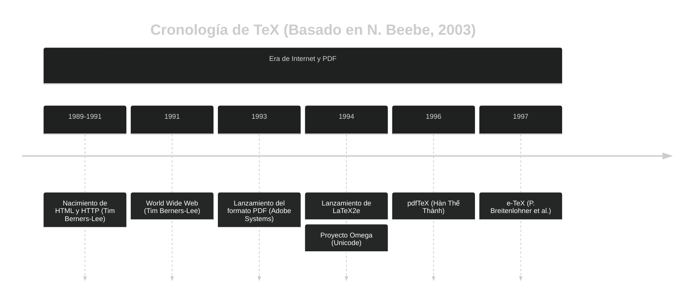

$\TeX$ es un sistema de composición tipográfica creado por Donald Knuth en la década de 1970 para producir documentos de alta calidad, previo a la existencia del PDF,  el internet, el HTML y la impresión digital moderna.

## Contenido

## EL surgimiento de TeX: Una respuesta a la crisis tipográfica

Para entender **TeX**, primero debemos viajar a finales de la década de 1960. Todo empieza con el profesor de Stanford **Donald Knuth** y su ambiciosa obra *The Art of Computer Programming*.
El primer volumen se publicó en 1978 y el segundo cinco años después. 
Nació en el Stanford Artificial Intelligence Laboratory (SAIL) como respuesta a la crisis tipográfica que enfrentaba la impresión de libros científicos y matemáticos en esa época. Crisis que Donald Knuth 
y su sana obsesión por la calidad tipográfica no podían tolerar.

>Era una obra monumental, repleta de fórmulas matemáticas complejas y diagramas intrincados. Knuth, un perfeccionista obsesionado con la calidad tipográfica, estaba encantado con la impresión del libro.

Hasta aquellos años la creación de documentos matemáticos de alta calidad dependía de una tecnología que había alcanzado su cúspide a finales del siglo XIX: la composición con metal caliente usando dos tipos de máquinas.
La máquina de composición **Monotype:**<CitationSup id={1}/> (Máquinas que fundían caracteres individuales, permitiendo una mayor flexibilidad para la notación matemática) era la que producía los textos matemáticos de mejor calidad hasta entonces.

Lamentablemente para Knuth y afortunadamente para $\TeX$, en la década de 1970, esta tecnología se volvió obsoleta por razones económicas y fue reemplazada por la fotocomposición.
>Esta caída de calidad visual (belleza según Knuth) fue lo que "horrorizó" a Knuth al ver las pruebas del volumen 2 de The Art of Computer Programming, impulsándolo a crear TeX para restaurar digitalmente la calidad de los antiguos maestros artesanos

Lo anterior lo cuenta el mismo Knuth cuenta en un discurso llamado _Digital Typography_ <CitationSup id={2}/>.

>Knuth, siendo un perfeccionista desde niño, decidió que no podía tolerar eso. 

## La obsesión con la calidad tipográfica y la composición

Una anécdota famosa de su juventud<CitationSup id={3}/> es cuando ganó un concurso de la compañía de dulces Ziegler's Giant Bar. 
El reto consistía en formar tantas palabras como fuera posible con las letras de la frase "Ziegler's Giant Bar". 
Mientras los jueces esperaban unas pocas docenas, el joven Knuth de 13 años, fingiendo dolor de estómago para quedarse en casa y trabajar en ello, 
encontró metódicamente más de 4,700 palabras, demostrando su temprana obsesión por la combinatoria, las listas y el procesamiento sistemático de datos (incluso antes de tener una computadora).

Otra anécdota contada en el discurso del premio Kyoto <CitationSup id={2}/> habla de su interés por las letras y la tipografía desde muy niño.
<QuoteAndAuthor quotation={{ quote: "De hecho, no solo siempre me han encantado los libros, sino que también me fascinan las letras individuales. Aquí les dejo una página del primer libro del abecedario que tuve de pequeña. Curiosamente, marqué cada serifa con una pequeña x y las conté: la letra K tiene 7 serifas. La letra P tiene 4; la letra O no tiene ninguna.", author: "Donald Knuth", source: ""}} />

### Knuth decide resolver el problema (tipográfico) él mismo
Luego de la decepción al recibir las copias de su libro tipografía hadas con las nuevas tecnologías de la época, empieza a buscar una solución editorial, encontrando en Polonia algunas personas que aún usan la tecnología tipográfica antigua, pero esto resulta casi imposible.
<QuoteAndAuthor quotation={{ quote: "My whole book had been completely retypeset with a different technology. The new fonts looked terrible! The subscripts were in a different style from the large letters, for example, and the spacing was very bad. You can look at books printed in the early 70s and it turns out that if it wasn't simple -- well, almost everything looked atrocious in those days.  I couldn't stand to see my books so ugly.", author:"Donald Knuth", source: "https://amturing.acm.org/pdf/KnuthTuringTranscript.pdf"}} /> 
En aquel entonces Knuth ya trabajaba en el _Laboratorio de Inteligencia Artificial de Stanford_ (SAIL), liderado por nada menos que John McCarthy. Allí tenían una impresora Xerox XPG <CitationSup id={4}/>
que era capaz de imprimir con una _densidad de 120 puntos por pulgada_, mucho mejor que las impresoras de matriz de puntos comunes en esa época aunque no suficientes para producir
las tipografías que quería Knuth.
En medio de esta búsqueda, febrero de 1977, se topa con las pruebas de la primera edición del libro _inteligencia artificial_ de Patrick Winston <CitationSup id={5}/>, 
que había sido compuesto con una impresora de matriz en la empresa Information International, Inc. (III), con una densidad de 1000 puntos por pulgada.
Knuth quedó impresionado por la calidad de impresión, y sobre todo por la técnica. La forma de composición utilizada se basaba en pixeles, era totalmente digital, con puntos de tinta. En lugar de imágenes
fotográficas, la impresora usaba algoritmos para calcular la posición exacta de cada punto de tinta en la página. Bits, según dice Knuth en <CitationSup id={6}/>.
<QuoteAndAuthor quotation={{ quote: "El problema de imprimir libros hermosos había pasado de ser un problema de metalurgia a un problema de óptica y luego a un problema de ciencias de la computación. Un problema de ceros y unos.", author: "Donald Knuth", source: "Conferencia del Premio Kyoto de Donald Knuth (1996)"}} />

En este momento Knuth abandona todo lo que estaba haciendo (iba por las primeras 100 páginas del cuarto volumen de The Art of Computer Programming) y decide resolver **el problema** él mismo.
>Pensó que le tomaría unos meses escribir un programa para solucionar este problema, durante su año sabático de 1978 en Chile (donde también pretendía aprender español). Le tomó casi una década. El resultado fue **TeX**.

En este punto Knuth se da cuenta de varios problemas, primero que nadie más estaba trabajando en este problema, y segundo que una máquina tipográfica era algo costoso para el presupuesto universitario. Tercero, 
no se podía pensar en el sistema tipográfico de impresión sin tener las fuentes y símbolos tipográficos necesarios. Knuth tenía que diseñar las formulas matemáticas para describir la forma de las fuentes y caracteres.
Trató de buscar ayuda en Xerox, pero la condición era que los derechos de uso de las fuentes que desarrollara fueran de Xerox. 
Knuth no estaba de acuerdo con esto pensando que una fórmula matemática no podía ser propiedad de nadie<CitationSup id={6}/>.

Intenta trabajar con las tecnologías disponibles en SAIL, pero no eran suficientes. Se trataba de capturar la imagen de las fuentes tipográficas con la mayor precisión posible utilizando cámaras de televisión.
Esto para poder trazar las fuentes y caracteres con la mayor precisión posible. También lo intentó con la ayuda de su esposa,  
fotografiando letras impresas con una cámara de alta resolución y proyectándolas en una pared para poder trazar las curvas a mano alzada, sin embargo no eran lo suficientemente claras.
En este intento se da cuenta de algo sencillo: que _las fuentes eran diseñadas por personas_
y se da cuenta que si las personas lo hacen, él podía hacer un programa de computadora que lo hiciera. 
Así nace **METAFONT**, el sistema para diseñar fuentes tipográficas mediante algoritmos matemáticos<CitationSup id={7}/> buscando encontrar lo que Knuth llamó
_la curva más placentera_, la cual encontró utilizando expresiones cúbicas.

En el diseño de fuentes tipográficas es importante mencionar a Hermann Zapf, un tipógrafo alemán que diseñó fuentes clásicas como Palatino, Optima y Zapfino, que colaboró en los 80s con Knuth en el diseño de la 
fuente **Computer Modern**, la fuente por defecto de TeX<CitationSup id={8}/>.

A mediados de 1977 trabajando en el prototipo de TeX, Knuth escribe una nota preliminar describiendo el sistema, donde explica el nombre y propósito de TeX. En mayo de 1977, Knuth diría lo siguiente: 
<QuoteAndAuthor quotation={{ quote: "TEX is for technical text. Insiders pronounce the X as a Greek Chi (cf. the Scottish `ch' sound in `Loch Ness') since the word `technical' stems from a Greek root meaning art as well as technology. I am preparing the system primarily for use in publishing my series --The Art of Computer Programming-- the initial system will be tuned for my books, but it will not be difficult to extend it for other purposes if anybody wants to do so.", author: "Donald Knuth", source: "Preliminary preliminary description of TEX (1977)"}} />

Hoy en día $\TeX$ es utilizado por importantes editoriales como Addison-Wesley (la de The Art of Computer Programming), Elsevier, Oxford o Springer<CitationSup id={9}/>. Cientos de libros se han publicado 
usando este sistema y miles de artículos científicos en todo el mundo. Incluso universidades tienen sus tesis en este formato.

## ¿Pero cómo TeX puede imprimir?
Primero METAFONT definía ecuaciones para las curvas (curvas de Bézier cúbicas) y el grosor del trazo. Esto creaba una "letra ideal" que era independiente de la resolución; existía solo como pura matemática (coordenadas).
Para poder imprimir, TeX usaba un proceso llamado "rasterización" que convertía estas definiciones matemáticas en una matriz de puntos (pixeles) que la impresora podía entender. 
La salida del proceso de compilación consistía de varios archivos, entre esos el archivo DVI (DeVice Independent) que contenía las instrucciones para colocar cada carácter en la página, y los archivos de fuentes generados por METAFONT.

Es por esto que $\TeX$ compone documentos de alta calidad aún sin la existencia del PDF. Fue concebido para la imprenta.
También es importante mencionar que TeX fue diseñado para ser independiente del dispositivo de salida (impresora o pantalla), por lo que 
un documentos escrito en TeX en 1990, se puede imprimir hoy (o en cien años) sin problemas en una impresora moderna, manteniendo la misma calidad tipográfica.

## Breve cronología de TeX y su ecosistema
$\TeX$ es uno de los sofwares más longevos que existen, y su desarrollo ha sido constante desde su creación en los años 70's. Fue inventado en 1978 y la versión "final" (1.0) se lanzó en 1982 conocida como $\TeX 82$.

Antecede a varias tecnologías importantes como PostScript (1984) y PDF (1993) así como a el protocolo HTTP, la World Wide Web y el HTML. Ha evolucionado para adaptarse a los nuevos tiempos, incluyendo soporte para Unicode y PDF nativo.

## La última versión, los números $\pi$ y $e$
En 1990, Knuth anunció que TeX y METAFONT no iban a cambiar más, sino que solo se les harían pequeñas correcciones de errores. De tal manera que sus versiones 
nuevas serían numeradas con los decimales de $\pi$ y $e$ respectivamente, hasta la fecha de su muerte. En este momento se congelarían las versiones y sería el fin de 
las actualizaciones del código fuente de $\TeX$ y METAFONT.

> La versión actual de TeX es $\TeX\, 3.14159265$ y la de METAFONT es $2.7182818$.

En la parte 2 de este post continuaremos hablando sobre las características de TeX, la particularidad de su nombre, su ecosistema actual y sus aplicaciones.

<ReferenceList references={[
  {id: "1", text:"Monotype System", url:"https://en.wikipedia.org/wiki/Monotype_system"}, 
  {id: "2", text: "Conferencia del Premio Kyoto de Donald Knuth (1996)", url:"https://www.kyotoprize.org/en/lectures/the-1996-kyoto-prize/"},
  {id:"3",text:"The Computer Scientist Who Can't Stop Telling Stories",url:"https://www.quantamagazine.org/computer-scientist-donald-knuth-cant-stop-telling-stories-20200416/"},
  {id:"4",text:"Xerox Graphics Printer (XGP)",url:"https://gunkies.org/wiki/Xerox_Graphics_Printer"},
  {id:"5",text:"Artificial Intelligence, Patrick H. Winston (1977)",url:"https://en.wikipedia.org/wiki/Artificial_Intelligence_(book)"},
  {id:"6",text:"An Interview with Donald Knuth 1974 ACM Turing Award Recipient (2007)",url:"https://amturing.acm.org/pdf/KnuthTuringTranscript.pdf"},
  {id:"7",text:"METAFONT en Wikipedia",url:"https://en.wikipedia.org/wiki/Metafont"},
  {id:"8",text:"Mathematical Typography, D. E. Knuth, Bulletin of the American Mathematical Society, Volume 1, Number 2, 1979, pp. 337-372.",url:"https://projecteuclid.org/journalArticle/Download?urlId=bams%2F1183544082&isResultClick=False"},
  {id:"9",text:"25 Years of TeX and METAFONT: Looking Back and Looking Forward, Nelson Beebe (2003)",url:"https://www.tug.org/TUGboat/Articles/tb25-1/beebe-2003keynote.pdf"},
]}/>
