The following application generates World Cup group stages using Genetic Algorithms.
The hyperparameters utilized are the same ones discussed [(in this post)](/blog/algoritmo-genetico-sorteo). However, to render this simulation directly in your browser, the logic has been ported from Python to JavaScript.

## FIFA World Cup Draw Generator
<SorteoMundial />

## Itinerary
Let us remember that FIFA has divided the qualifying teams into two opposite paths, so that the teams that end up on one of these two paths will not meet those on the opposite path, only in the final.

## Genetic Algorithm Flowchart for the FIFA Draw:

```mermaid
graph TD
    %% Start and Configuration Nodes
    Start([User clicks 'Run Draw']) --> InitData[generateTeamData<br/>Defines Teams, Pots, and Fixed Constraints]
    InitData --> InitPop[Initialize Population<br/>createIndividual x 100]
    
    %% Note on individual creation
    InitPop -.-> Eval
    Eval[calcFitness<br/>Evaluates each draw]

    %% Main GA Loop
    subgraph Ciclo_Genetico ["Generational Loop (Max 1000)"]
        Eval --> CheckSuccess
        direction TB
        
        Sort[Sort Population by Ascending Cost]
        
        CheckSuccess{Cost == 0?}
        
        %% Decision Branches
        CheckSuccess -- Yes --> Found([Solution Found!<br/>Return Valid Draw])
        CheckSuccess -- No --> CheckGen{Generations Exhausted?}
        
        CheckGen -- Yes --> StopMax([Terminate:<br/>Return Best Approximation])
        CheckGen -- No --> Reproduction
        
        %% Genetic Operators
        subgraph Reproduction [Reproduction and Variation]
            Select[Roulette Selection<br/>Probability ~ 1/Cost]
            Cross[Crossover<br/>Swap entire Pots]
            Mut[Mutation<br/>Swap 2 random teams<br/>within the same pot]
        end
        
        Sort --> Select
        Select --> Cross --> Mut --> NewPop[New Population]
    end

    NewPop --> Eval

    %% Styles for visual clarity
    style Start fill:#0077FF,stroke:#fff,color:#fff
    style Found fill:#00cc66,stroke:#fff,color:#fff
    style StopMax fill:#FF3366,stroke:#fff,color:#fff
    style Eval fill:#2c2c00,stroke:#FF3366,color:#fff
    style Reproduction fill:#1a1a1a,stroke:#666,stroke-dasharray: 5 5
    style Ciclo_Genetico fill:#fceaaeff
```

<RepoBadge url={"https://github.com/EricLuceroGonzalez/algorithms-share/tree/main/Genetic-algorithms"}/>