El siguiente programa genera grupos del mundial usando algoritmos genéticos.
Los hiperparámetros son los mencionados que [(en este post)](/blog/algoritmo-genetico-sorteo). La diferencia es que para
poder apreciarlo la lógica está hecha en JavaScript en lugar de Python.

## Generador del sorteo de la Copa Mundial de la FIFA
<SorteoMundial />

## Flujo del algoritmo genético para el sorteo de la FIFA:

```mermaid
graph TD
    %% Nodos de Inicio y Configuración
    Start([Usuario hace clic en 'Ejecutar Sorteo']) --> InitData[generarDatosEquipos<br/>Define Equipos, Bombos y Restricciones Fijas]
    InitData --> InitPop[Inicializar Población<br/>crearIndividuo x 100]
    
    %% Nota sobre la creación de individuos
    InitPop -.-> Eval
    Eval[calcularFitness<br/>Evalúa cada sorteo]

    Eval --> CheckSuccess
    %% Bucle Principal del GA
    subgraph Ciclo_Genetico ["Bucle Generacional (Max 1000)"]
        direction TB
        
        Sort[Ordenar Población por Costo Ascendente]
        
        CheckSuccess{¿Costo == 0?}
        
        %% Ramas de decisión
        CheckSuccess -- Sí --> Found([¡Solución Encontrada!<br/>Retornar Sorteo Válido])
        CheckSuccess -- No --> CheckGen{¿Generaciones Agotadas?}
        
        CheckGen -- Sí --> StopMax([Terminar:<br/>Retornar Mejor Aproximación])
        CheckGen -- No --> Reproduction
        
        %% Operadores Genéticos
        subgraph Reproduction [Reproducción y Variación]
            Select[Selección por Ruleta<br/>Probabilidad ~ 1/Costo]
            Cross[Cruce / Crossover<br/>Intercambio de Bombos completos]
            Mut[Mutación<br/>Swap de 2 equipos aleatorios<br/>dentro del mismo bombo]
        end
        
        Sort --> Select
        Select --> Cross --> Mut --> NewPop[Nueva Población]
    end

    NewPop --> Eval

    %% Estilos para dar claridad visual
    style Start fill:#0077FF,stroke:#fff,color:#fff
    style Found fill:#00cc66,stroke:#fff,color:#fff
    style StopMax fill:#FF3366,stroke:#fff,color:#fff
    style Eval fill:#2c2c00,stroke:#FF3366,color:#fff
    style Reproduction fill:#1a1a1a,stroke:#666,stroke-dasharray: 5 5
```

<RepoBadge url={"https://github.com/EricLuceroGonzalez/algorithms-share/tree/main/Genetic-algorithms"}/>