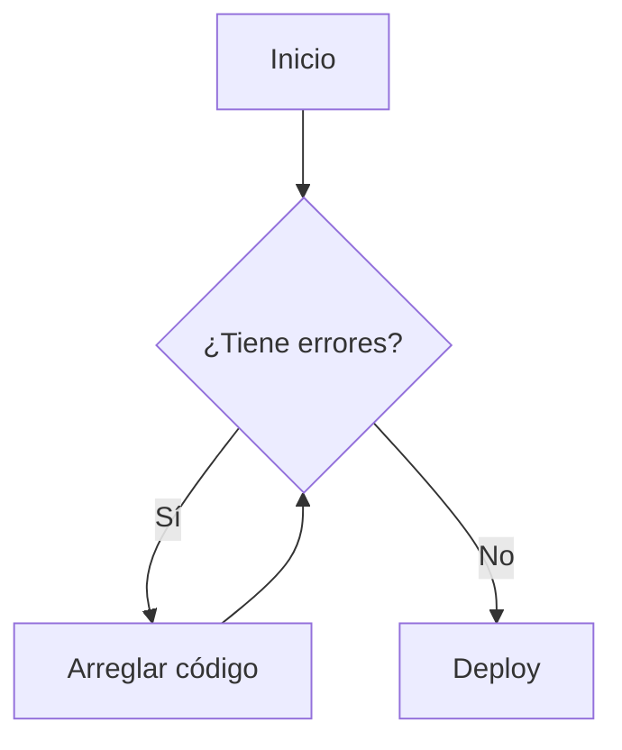
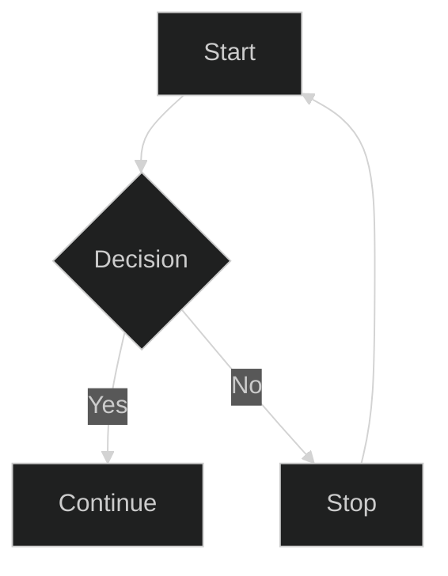

<SorteoMundial />


Flujo del algoritmo genético para el sorteo de la FIFA:



```python

class Equipo:
    def __init__(self, nombre, confederacion, bombo, grupo_fijo=None, ranking_top=None):
        self.nombre = nombre
        self.confederacion = confederacion  # String simple
        self.bombo = bombo
        self.grupo_fijo = grupo_fijo
        self.ranking_top = ranking_top  # 1, 2, 3, 4 o None

    def __repr__(self):
        # Muestra info útil al imprimir
        r = f" [R#{self.ranking_top}]" if self.ranking_top else ""
        f = f" (Fijo:{self.grupo_fijo})" if self.grupo_fijo else ""
        return f"{self.nombre}{r}{f}"
```